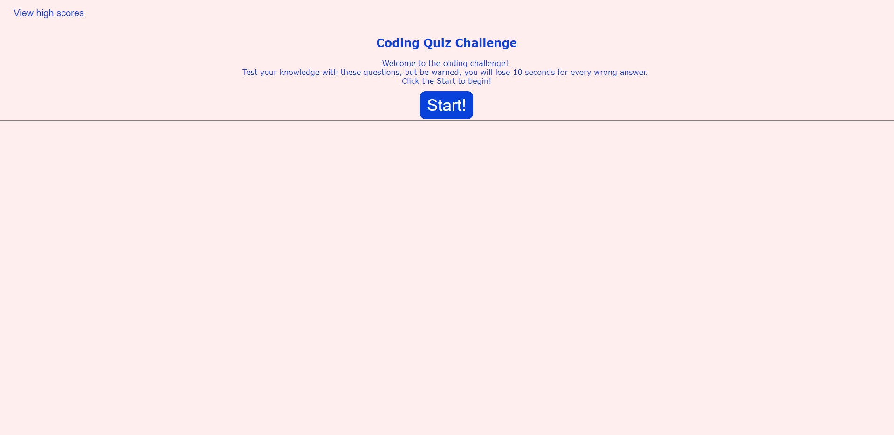

# Code Quiz Challenge
The purpose of this project is to create a code quiz using javascript and allow users to save their scores after each attempt.

### Criteria:
* Start button to begin
    * Timer starts
    * Question is presented
* After answering a question, the next one is displayed
    * Incorrect answers deduct time from clock
* When all questions are answered or timer runs out
    * Game is over
* When game is over
    * Present option to enter initials 
    * Allow score to be saved
    * Allow high/saved scores to be displayed

### Web tools used
* HTML
* Javascript
* CSS

## Website
https://zoomzooom6.github.io/Code_Quiz/

## Contribution
Designed by Tony Huang.

## Final Results

### Main start page

### Sample question page

### End of quiz page

### High scores view
